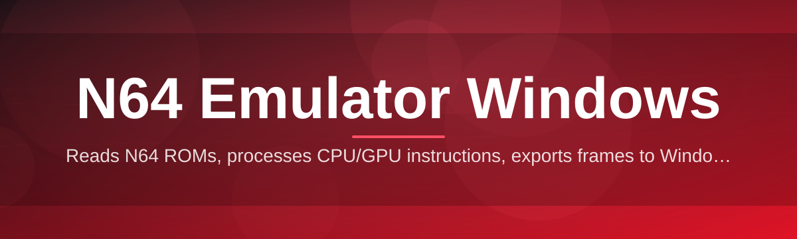

# n64-emulator-config-editor

Reads N64 ROMs, processes CPU/GPU instructions, exports frames to Windows — no setup

  

## Overview

Reads N64 ROMs, processes CPU/GPU instructions, exports frames to Windows — no setup

## License

[MIT License](LICENSE)
